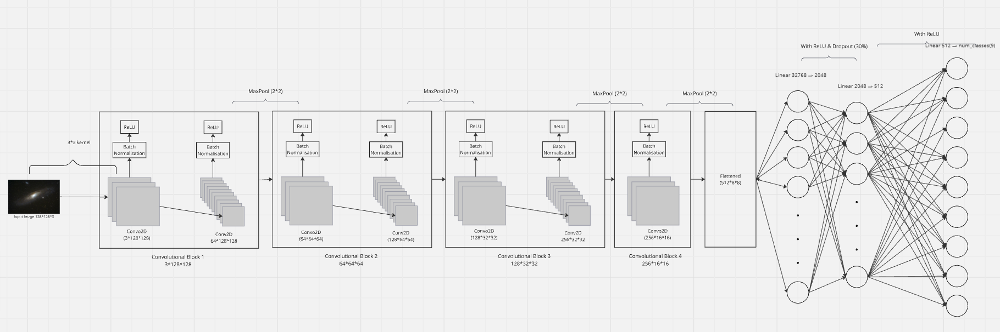
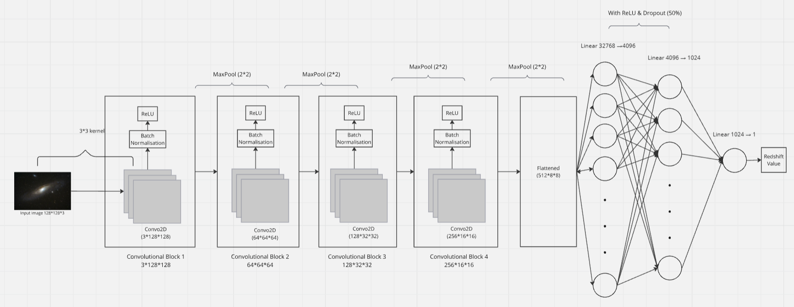

# Galaxy Morphology Classification and Redshift Estimation

## 📋 Project Overview

This project focuses on automated galaxy morphology classification and redshift estimation using deep learning techniques. The system combines computer vision models for morphological analysis with hybrid approaches for accurate redshift prediction, providing a comprehensive solution for astronomical data analysis.

## 🏗️ Project Structure

```
📦 Final Year Project/
├── Architecture-Diagrams/          # Model architecture images (CNN, CvT, Redshift)
├── Datasets/                       # Real + synthetic galaxy datasets and processing notebooks
│   ├── api_galaxy_images/          # Galaxy images from API sources
│   ├── synthetic_galaxy_images/    # Generated synthetic galaxy data
│   ├── galaxy.csv                  # Galaxy metadata and labels
│   ├── Galaxy10.h5                 # Galaxy10 dataset
│   └── Synthetic-Database-Creation.ipynb  # Notebook for synthetic data generation
├── Galaxy-Morphology/              # Morphology classification notebooks (multiple model versions)
│   ├── Galaxy-Morphology-CNN/      # CNN-based morphology classification
│   └── State-Of-The-Art/           # Advanced model implementations
├── Interface/                      # Dashboard script for user interaction
├── Metrics-Galaxy-Morphology/      # Confusion matrices and loss plots for morphology models
├── Metrics-Redshift/               # Redshift estimation evaluation visuals
├── Models/                         # Saved trained models (.pth files)
├── Redshift-Estimation/            # Notebooks for hybrid redshift estimation
└── Testing/                        # Final testing reports, visualizations, predictions
```

## 🏗️ Model Architecture

This project implements multiple deep learning architectures for galaxy morphology classification and redshift estimation:

### CNN Architecture

*Convolutional Neural Network architecture for galaxy morphology classification*

### Computer Vision Transformer (CvT)

*Vision Transformer architecture for advanced galaxy classification*

### Redshift Estimation Model

*Hybrid architecture for galaxy redshift estimation*

## 👥 Contributors

This project was developed collaboratively by:

- **Asim Avhad** - https://www.linkedin.com/in/asim-avhad
- **Aditi Ahirrao** - https://www.linkedin.com/in/aditi-ahirrao/
- **Shaunak More** - https://www.linkedin.com/in/shaunak-more-37171a285/
- **Kaustubh More** - https://www.linkedin.com/in/kaustubhmore7887/

*Please feel free to connect with us on LinkedIn for discussions about this project or astronomical data analysis!*

## 🎯 Key Features

- **Galaxy Morphology Classification**: Automated classification of galaxy types using CNN and state-of-the-art vision transformer models
- **Redshift Estimation**: Hybrid approach combining multiple techniques for accurate redshift prediction
- **Synthetic Data Generation**: Creation of synthetic galaxy datasets to augment training data
- **Interactive Dashboard**: User-friendly interface for model interaction and visualization
- **Comprehensive Evaluation**: Detailed metrics and visualizations for model performance assessment

## 🔧 Technologies Used

- **Deep Learning**: PyTorch, CNN, Computer Vision Transformers (CvT)
- **Data Processing**: Python, Pandas, NumPy
- **Visualization**: Matplotlib, Seaborn
- **Astronomical Data**: Galaxy10 dataset, API-sourced galaxy images
- **Model Development**: Jupyter Notebooks

## 📊 Datasets

- **Galaxy10**: Standard astronomical dataset for galaxy classification
- **API Galaxy Images**: Real galaxy images sourced from astronomical APIs
- **Synthetic Galaxy Images**: Generated synthetic data for data augmentation
- **Galaxy Metadata**: CSV files containing galaxy properties and labels

## 🚀 Models

The project implements multiple approaches:

1. **CNN-based Morphology Classification**: Traditional convolutional neural networks for galaxy type classification
2. **State-of-the-Art Models**: Advanced vision transformers and hybrid architectures
3. **Hybrid Redshift Estimation**: Combined photometric and spectroscopic redshift estimation techniques

## 📈 Performance Metrics

### Galaxy Morphology Classification Results

#### Training Set Performance
- **Accuracy**: 90.77% (12,879/14,189 correct predictions)

| Class | Precision | Recall | F1-Score | Support |
|-------|-----------|--------|----------|---------|
| 0     | 0.80      | 0.70   | 0.75     | 888     |
| 1     | 0.95      | 0.97   | 0.96     | 1,515   |
| 2     | 0.94      | 0.97   | 0.95     | 2,102   |
| 3     | 0.93      | 0.97   | 0.95     | 1,613   |
| 4     | 0.76      | 1.00   | 0.87     | 263     |
| 5     | 0.86      | 0.94   | 0.89     | 1,624   |
| 6     | 0.86      | 0.86   | 0.86     | 1,484   |
| 7     | 0.89      | 0.74   | 0.81     | 2,069   |
| 8     | 0.95      | 0.99   | 0.97     | 1,134   |
| 9     | 0.97      | 0.97   | 0.97     | 1,497   |

**Overall Metrics:**
- Macro Average: Precision 0.89, Recall 0.91, F1-Score 0.90
- Weighted Average: Precision 0.91, Recall 0.91, F1-Score 0.91

#### Validation Set Performance
- **Accuracy**: 90.19% (3,199/3,547 correct predictions)

| Class | Precision | Recall | F1-Score | Support |
|-------|-----------|--------|----------|---------|
| 0     | 0.75      | 0.69   | 0.72     | 193     |
| 1     | 0.94      | 0.96   | 0.95     | 338     |
| 2     | 0.94      | 0.97   | 0.95     | 543     |
| 3     | 0.94      | 0.97   | 0.96     | 414     |
| 4     | 0.77      | 1.00   | 0.87     | 71      |
| 5     | 0.87      | 0.90   | 0.88     | 419     |
| 6     | 0.82      | 0.90   | 0.86     | 345     |
| 7     | 0.89      | 0.73   | 0.80     | 559     |
| 8     | 0.95      | 0.98   | 0.97     | 289     |
| 9     | 0.96      | 0.97   | 0.96     | 376     |

**Overall Metrics:**
- Macro Average: Precision 0.88, Recall 0.91, F1-Score 0.89
- Weighted Average: Precision 0.90, Recall 0.90, F1-Score 0.90

#### Test Set Performance
- **Overall Test Accuracy**: 93.33%

### Additional Performance Analysis
- Confusion matrices for morphology classification accuracy
- Loss plots and training curves
- Redshift estimation error analysis
- Comprehensive testing reports with visualizations

## 🎨 Visualizations

- Model architecture diagrams
- Training and validation metrics
- Prediction results and comparisons
- Interactive dashboard for real-time analysis

## 🛠️ Installation and Setup

### Prerequisites
- Python 3.7 or higher
- pip package manager

### Installation Steps

1. **Clone the repository**
   ```bash
   git clone <repository-url>
   cd "Project"
   ```

2. **Install dependencies**
   ```bash
   pip install -r requirements.txt
   ```

3. **Download required model files**
   - Ensure you have the trained model files:
     - `Galaxy-Morphology-Final.pth`
     - `Redshift-Final.pth`

## 🚀 Running the Dashboard

To run the final output dashboard:

1. **Create a working directory** and place the following files together:
   ```
   dashboard-folder/
   ├── Dashboard.py
   ├── Galaxy-Morphology-Final.pth
   └── Redshift-Final.pth
   ```

2. **Run the dashboard**
   ```bash
   python Dashboard.py
   ```

3. **Access the interface**
   - The dashboard will start and provide an interactive interface for galaxy analysis
   - Upload galaxy images to get morphology classification and redshift estimation results

## 📋 Requirements

All required dependencies are listed in `requirements.txt`. Key packages include:
- PyTorch
- NumPy
- h5py
- Matplotlib
- Seaborn
- Jupyter
- Pandas
- Additional astronomical and machine learning libraries

## 🔬 Research Applications

This project contributes to:
- Automated astronomical survey analysis
- Large-scale galaxy classification
- Cosmological distance measurements
- Deep learning applications in astronomy

---