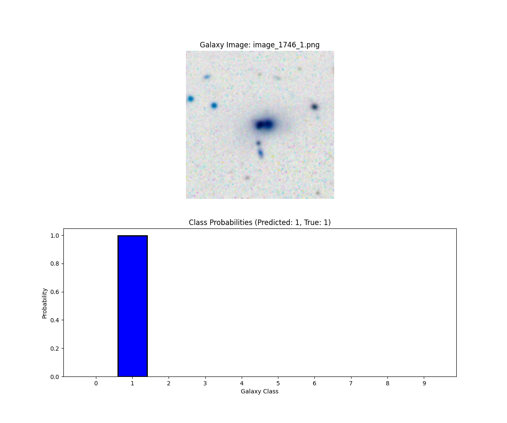

# Galaxy Classification Test Cases and Results

Date: 2025-04-27 14:32:42

## Individual Test Cases

### Test Case 1: image_10821_6.png

- **Filename:** image_10821_6.png
- **True Class:** 6
- **Predicted Class:** 6
- **Correct:** YES
- **Confidence:** 93.32%

| Class | Probability |
|-------|-------------|
| 0 | 0.24% |
| 1 | 0.24% |
| 2 | 0.95% |
| 3 | 0.00% |
| 4 | 0.00% |
| 5 | 0.08% |
| 6 | 93.32% |
| 7 | 5.14% |
| 8 | 0.02% |
| 9 | 0.00% |

---

### Test Case 2: image_120_0.png

- **Filename:** image_120_0.png
- **True Class:** 0
- **Predicted Class:** 0
- **Correct:** YES
- **Confidence:** 94.50%

| Class | Probability |
|-------|-------------|
| 0 | 94.50% |
| 1 | 0.29% |
| 2 | 0.00% |
| 3 | 0.00% |
| 4 | 0.00% |
| 5 | 1.60% |
| 6 | 0.00% |
| 7 | 2.09% |
| 8 | 0.00% |
| 9 | 1.51% |

---

### Test Case 3: image_16601_9.png

- **Filename:** image_16601_9.png
- **True Class:** 9
- **Predicted Class:** 9
- **Correct:** YES
- **Confidence:** 77.45%

| Class | Probability |
|-------|-------------|
| 0 | 0.01% |
| 1 | 0.01% |
| 2 | 0.00% |
| 3 | 0.00% |
| 4 | 0.00% |
| 5 | 0.00% |
| 6 | 0.00% |
| 7 | 0.01% |
| 8 | 22.52% |
| 9 | 77.45% |

---

### Test Case 4: image_16874_9.png

- **Filename:** image_16874_9.png
- **True Class:** 9
- **Predicted Class:** 9
- **Correct:** YES
- **Confidence:** 99.99%

| Class | Probability |
|-------|-------------|
| 0 | 0.00% |
| 1 | 0.01% |
| 2 | 0.00% |
| 3 | 0.00% |
| 4 | 0.00% |
| 5 | 0.00% |
| 6 | 0.00% |
| 7 | 0.00% |
| 8 | 0.01% |
| 9 | 99.99% |

---

### Test Case 5: image_12465_7.png

- **Filename:** image_12465_7.png
- **True Class:** 7
- **Predicted Class:** 7
- **Correct:** YES
- **Confidence:** 58.78%

| Class | Probability |
|-------|-------------|
| 0 | 15.77% |
| 1 | 1.19% |
| 2 | 0.01% |
| 3 | 2.55% |
| 4 | 3.49% |
| 5 | 10.34% |
| 6 | 6.37% |
| 7 | 58.78% |
| 8 | 0.24% |
| 9 | 1.28% |

---

### Test Case 6: image_11713_6.png

- **Filename:** image_11713_6.png
- **True Class:** 6
- **Predicted Class:** 6
- **Correct:** YES
- **Confidence:** 95.92%

| Class | Probability |
|-------|-------------|
| 0 | 0.24% |
| 1 | 0.04% |
| 2 | 0.00% |
| 3 | 0.86% |
| 4 | 0.06% |
| 5 | 2.27% |
| 6 | 95.92% |
| 7 | 0.40% |
| 8 | 0.06% |
| 9 | 0.15% |

---

### Test Case 7: image_16991_9.png

- **Filename:** image_16991_9.png
- **True Class:** 9
- **Predicted Class:** 9
- **Correct:** YES
- **Confidence:** 100.00%

| Class | Probability |
|-------|-------------|
| 0 | 0.00% |
| 1 | 0.00% |
| 2 | 0.00% |
| 3 | 0.00% |
| 4 | 0.00% |
| 5 | 0.00% |
| 6 | 0.00% |
| 7 | 0.00% |
| 8 | 0.00% |
| 9 | 100.00% |

---

### Test Case 8: image_1117_1.png

- **Filename:** image_1117_1.png
- **True Class:** 1
- **Predicted Class:** 1
- **Correct:** YES
- **Confidence:** 99.54%

| Class | Probability |
|-------|-------------|
| 0 | 0.02% |
| 1 | 99.54% |
| 2 | 0.08% |
| 3 | 0.18% |
| 4 | 0.00% |
| 5 | 0.02% |
| 6 | 0.00% |
| 7 | 0.01% |
| 8 | 0.00% |
| 9 | 0.15% |

---

### Test Case 9: image_8008_5.png

- **Filename:** image_8008_5.png
- **True Class:** 5
- **Predicted Class:** 5
- **Correct:** YES
- **Confidence:** 97.92%

| Class | Probability |
|-------|-------------|
| 0 | 0.13% |
| 1 | 0.04% |
| 2 | 0.11% |
| 3 | 0.00% |
| 4 | 0.00% |
| 5 | 97.92% |
| 6 | 0.02% |
| 7 | 1.14% |
| 8 | 0.00% |
| 9 | 0.64% |

---

### Test Case 10: image_12096_7.png

- **Filename:** image_12096_7.png
- **True Class:** 7
- **Predicted Class:** 7
- **Correct:** YES
- **Confidence:** 78.15%

| Class | Probability |
|-------|-------------|
| 0 | 11.12% |
| 1 | 0.12% |
| 2 | 0.11% |
| 3 | 0.05% |
| 4 | 0.00% |
| 5 | 1.29% |
| 6 | 9.05% |
| 7 | 78.15% |
| 8 | 0.03% |
| 9 | 0.06% |

---

### Test Case 11: image_10557_6.png

- **Filename:** image_10557_6.png
- **True Class:** 6
- **Predicted Class:** 6
- **Correct:** YES
- **Confidence:** 89.75%

| Class | Probability |
|-------|-------------|
| 0 | 0.28% |
| 1 | 0.03% |
| 2 | 0.00% |
| 3 | 0.70% |
| 4 | 0.06% |
| 5 | 2.54% |
| 6 | 89.75% |
| 7 | 6.34% |
| 8 | 0.05% |
| 9 | 0.25% |

---

### Test Case 12: image_793_0.png

- **Filename:** image_793_0.png
- **True Class:** 0
- **Predicted Class:** 3
- **Correct:** NO
- **Confidence:** 61.03%

| Class | Probability |
|-------|-------------|
| 0 | 38.08% |
| 1 | 0.08% |
| 2 | 0.08% |
| 3 | 61.03% |
| 4 | 0.10% |
| 5 | 0.06% |
| 6 | 0.01% |
| 7 | 0.04% |
| 8 | 0.00% |
| 9 | 0.53% |

---

### Test Case 13: image_1746_1.png

- **Filename:** image_1746_1.png
- **True Class:** 1
- **Predicted Class:** 1
- **Correct:** YES
- **Confidence:** 99.83%

| Class | Probability |
|-------|-------------|
| 0 | 0.00% |
| 1 | 99.83% |
| 2 | 0.09% |
| 3 | 0.07% |
| 4 | 0.00% |
| 5 | 0.00% |
| 6 | 0.00% |
| 7 | 0.00% |
| 8 | 0.00% |
| 9 | 0.00% |

---

### Test Case 14: image_12927_7.png

- **Filename:** image_12927_7.png
- **True Class:** 7
- **Predicted Class:** 7
- **Correct:** YES
- **Confidence:** 89.21%

| Class | Probability |
|-------|-------------|
| 0 | 8.32% |
| 1 | 0.02% |
| 2 | 0.01% |
| 3 | 0.00% |
| 4 | 0.00% |
| 5 | 2.41% |
| 6 | 0.04% |
| 7 | 89.21% |
| 8 | 0.00% |
| 9 | 0.00% |

---

### Test Case 15: image_7705_4.png

- **Filename:** image_7705_4.png
- **True Class:** 4
- **Predicted Class:** 4
- **Correct:** YES
- **Confidence:** 99.84%

| Class | Probability |
|-------|-------------|
| 0 | 0.02% |
| 1 | 0.00% |
| 2 | 0.00% |
| 3 | 0.00% |
| 4 | 99.84% |
| 5 | 0.00% |
| 6 | 0.01% |
| 7 | 0.01% |
| 8 | 0.11% |
| 9 | 0.00% |

---

## Summary of Test Results

- **Total Test Cases:** 15
- **Correctly Classified:** 14
- **Test Accuracy:** 93.33%
- **Average Confidence:** 89.01%

## Test Cases Overview

| # | Image | True Class | Predicted | Correct | Confidence |
|---|-------|------------|-----------|---------|------------|
| 1 | [image_10821_6.png](test_case_1.png) | 6 | 6 | YES | 93.32% |
| 2 | [image_120_0.png](test_case_2.png) | 0 | 0 | YES | 94.50% |
| 3 | [image_16601_9.png](test_case_3.png) | 9 | 9 | YES | 77.45% |
| 4 | [image_16874_9.png](test_case_4.png) | 9 | 9 | YES | 99.99% |
| 5 | [image_12465_7.png](test_case_5.png) | 7 | 7 | YES | 58.78% |
| 6 | [image_11713_6.png](test_case_6.png) | 6 | 6 | YES | 95.92% |
| 7 | [image_16991_9.png](test_case_7.png) | 9 | 9 | YES | 100.00% |
| 8 | [image_1117_1.png](test_case_8.png) | 1 | 1 | YES | 99.54% |
| 9 | [image_8008_5.png](test_case_9.png) | 5 | 5 | YES | 97.92% |
| 10 | [image_12096_7.png](test_case_10.png) | 7 | 7 | YES | 78.15% |
| 11 | [image_10557_6.png](test_case_11.png) | 6 | 6 | YES | 89.75% |
| 12 | [image_793_0.png](test_case_12.png) | 0 | 3 | NO | 61.03% |
| 13 | [image_1746_1.png](test_case_13.png) | 1 | 1 | YES | 99.83% |
| 14 | [image_12927_7.png](test_case_14.png) | 7 | 7 | YES | 89.21% |
| 15 | [image_7705_4.png](test_case_15.png) | 4 | 4 | YES | 99.84% |
